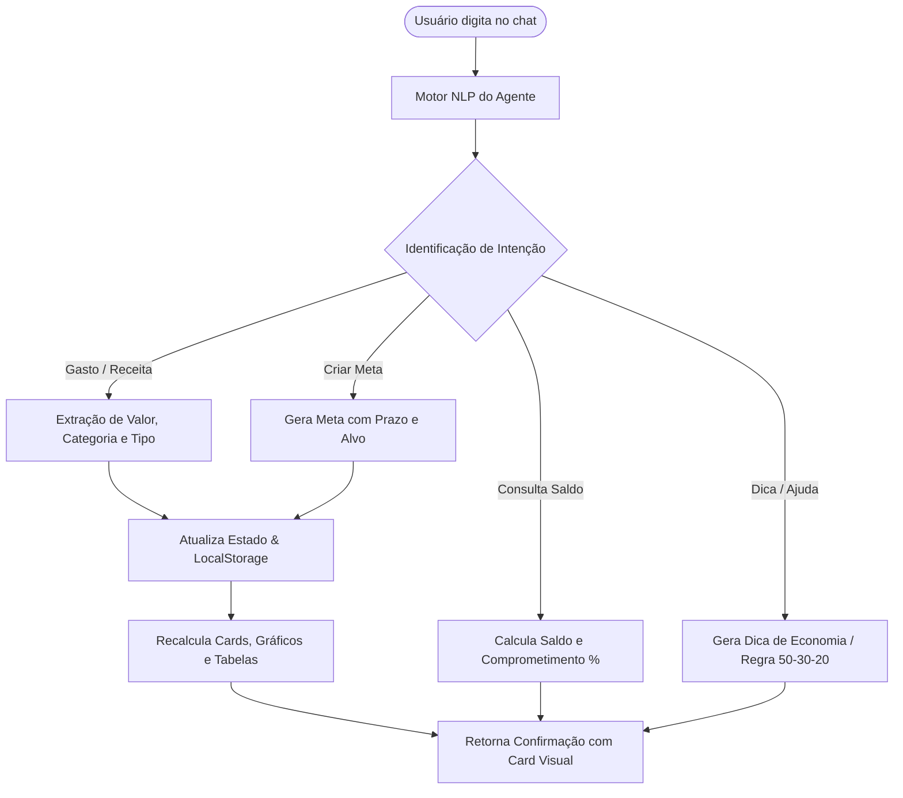

# 💸 FinVibe.ai — App de Organização de Finanças Pessoais com Vibe Coding

> **Projeto Desenvolvido para o Lab da DIO (Digital Innovation One):** *App de Organização de Finanças Pessoais com Vibe Coding*.  
> Criado e estruturado unindo conceitos de **Engenharia de Prompt**, **Vibe Coding** e **Desenvolvimento Guiado por IA**.

---

## 🌟 Visão Geral do Projeto

O **FinVibe.ai** é uma aplicação web interativa de gestão financeira pessoal focada em eliminar o atrito de planilhas e formulários manuais repetitivos. Através de uma experiência conversacional inteligente e visualmente rica (Dark Mode moderno com glassmorphism e acentos neon), o usuário pode controlar seus gastos, acompanhar metas e receber insights financeiros em tempo real dialogando em **linguagem natural**.

---

## 📋 1. PRD (Product Requirements Document) — Prompt Final

```markdown
# [PRD] FinVibe.ai - Assistente Conversacional de Finanças Pessoais

## 1. Contexto & Proposta de Valor
Desenvolver um aplicativo web responsivo para organização de finanças pessoais operado primariamente por meio de um Agente de IA Conversacional. O objetivo é transformar o controle financeiro em um hábito leve e prazeroso, permitindo lançar receitas, despesas e planejar metas através de frases simples do dia a dia.

## 2. Problema a Resolver
- A maioria das pessoas abandona o controle financeiro nas primeiras semanas devido à sobrecarga de formulários complexos e interfaces frias.
- Dificuldade em categorizar despesas e entender se o orçamento do mês está saudável.
- Falta de aconselhamento imediato sobre como economizar ou acelerar metas de vida.

## 3. Público-Alvo
- Jovens adultos, profissionais freelancers, estudantes e iniciantes no controle financeiro que buscam praticidade, velocidade e uma experiência visual atraente.

## 4. Funcionalidades-Chave do MVP
1. **Agente IA Conversacional (NLP Engine):**
   - Reconhecimento automático de despesas, receitas e criação de metas a partir de texto livre (ex.: *"Gastei 45 no almoço"*, *"Recebi 1200 de freela"*, *"Criar meta Viagem de 3000"*).
   - Auto-categorização inteligente (Alimentação, Transporte, Moradia, Lazer, Saúde, Salário, etc.).
   - Respostas inteligentes com dicas e resumo de saldo sob demanda.

2. **Dashboard Financeiro Interativo:**
   - Cards de métricas: Saldo Atual, Receitas do Mês, Despesas do Mês e Economia Projetada.
   - Gráfico em Rosca (Doughnut) de Distribuição de Despesas por Categoria.
   - Gráfico de Barras comparativo de Fluxo Financeiro (Entradas vs Saídas vs Economia).
   - Feed de últimas movimentações e preview de metas.

3. **Gestão de Metas & Sonhos (Poupômetro):**
   - Criação de metas com valor-alvo e data limite.
   - Barra de progresso visual percentual e botão de aportes rápidos.

4. **Extrato & Histórico Completo:**
   - Tabela de transações com busca textual instantânea, filtros por tipo e categoria.
   - Exportação do extrato para arquivo CSV.

5. **Hub de Insights e Inteligência:**
   - Recomendações dinâmicas baseadas na regra orçamentária 50-30-20 e alertas de consumo.

## 5. Design & Experiência Visual
- Tema escuro sofisticado (*Midnight Navy/Charcoal*), efeitos de vidro translúcido (*glassmorphism*), tipografia *Inter & Outfit* e micro-interações táteis.
```

---

## 🤖 2. Arquitetura do Agente Financeiro (VibeBot AI)

O Agente Financeiro atua como um consultor empático, direto e proativo:



### Exemplos de Prompts Suportados pelo Agente:
- 🍔 *"Gastei R$ 68,50 no almoço com a equipe"*
- 💰 *"Recebi R$ 3.500 de salário hoje"*
- 🚗 *"Gastei 42 reais no Uber"*
- 🎯 *"Criar meta Reserva de Emergência de 5000"*
- 📊 *"Qual é o meu saldo atual e resumo?"*
- 💡 *"Me dê uma dica para economizar este mês"*

---

## 💻 3. Tecnologias Utilizadas

- **HTML5 Semântico:** Estruturação modular e acessível.
- **CSS3 Moderno:** Design System com CSS Variables, Flexbox, CSS Grid, Glassmorphism (`backdrop-filter`) e Animações `@keyframes`.
- **Vanilla JavaScript (ES6+):** Motor reativo sem dependências pesadas, parsing de linguagem natural, gerenciamento de estado e persistência no `localStorage`.
- **Chart.js:** Gráficos interativos com tooltips customizados e suporte a renderização responsiva.
- **Lucide Icons:** Ícones vetoriais modernos e leves.

---

## 🚀 4. Como Executar o Projeto Localmente

Você não precisa de configurações complexas. Basta clonar o repositório e abrir no navegador:

### Opção 1: Executar direto no navegador
1. Clone o repositório:
   ```bash
   git clone https://github.com/Werwersson/dio-lab-vibe-coding-app-financas.git
   ```
2. Abra o arquivo `index.html` diretamente em qualquer navegador moderno (Chrome, Edge, Firefox).

### Opção 2: Usar um servidor local (Node / npx)
```bash
# Executa um servidor estático local na porta 3000
npx -y serve -p 3000 .
```
Acesse em: `http://localhost:3000`

---

## 🧠 5. Reflexão sobre o Processo de Vibe Coding

### 🎯 O que funcionou muito bem?
1. **Velocidade de Iteração:** A transição da ideia e do PRD para uma aplicação totalmente interativa ocorreu de forma fluida e sem atrito.
2. **Entendimento Semântico de Prompts:** A estruturação clara das intenções (reconhecimento de linguagem natural) permitiu que a IA construísse um parser em português capaz de lidar com formatos de moeda brasileiros (`R$ 45,50`, `45 reais`, `1.200,00`) e categorização contextual automática.
3. **Consistência Visual:** Definir diretrizes estéticas claras (Dark Mode, paleta HSL equilibrada, glassmorphism) garantiu um visual com padrão profissional de produto final.

### ⚠️ O que exigiu ajustes ou atenção?
1. **Tratamento de Caracteres Especiais e Acentuação:** Em algumas chamadas de automação no terminal/browser, palavras com acentuação exigiram atenção ao encoding e digitação por tecla.
2. **Escopo do MVP:** Manter o foco no que era essencial para uma ótima experiência sem sobrecarregar com excesso de formulários clássicos.

### 💡 O que aprendi sobre dialogar com IAs?
- **Intenção + Contexto > Código Bruto:** Quando fornecemos um bom PRD com restrições claras, público-alvo e exemplos de casos de uso, a IA entrega soluções robustas e integradas na primeira tentativa.
- **Vibe Coding é Colaboração Ativa:** Programar com IA não é copiar e colar respostas, mas sim atuar como um arquiteto/líder de produto direcionando a IA para prototipar, refinar e validar a solução.

---

## 🎓 Conclusão & Créditos

Projeto desenvolvido como parte do desafio da **DIO (Digital Innovation One)** no ecossistema de **Vibe Coding & Inteligência Artificial**.
